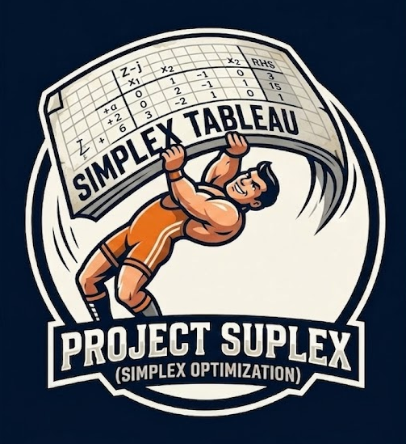

# Project Suplex — Simplex Optimization

<p align="center">
  
</p>

Solucionador do **Método Simplex** (Fase I + Fase II) com interface web interativa e integração com LLM local (Llama 3 via Ollama).

## Stack

| Camada | Tecnologia |
|--------|-----------|
| Core | Python 3, NumPy (apenas matrizes; pivoteamento manual) |
| CLI | `argparse` |
| UI | Streamlit + Plotly |
| LLM | Llama 3 self-hosted via [Ollama](https://ollama.com) |

---

## 1. Instalação do Projeto

```bash
git clone <repo-url>
cd Suplex_Bot
bash setup.sh          # cria .venv e instala dependências Python
source .venv/bin/activate
```

---

## 2. Configuração do Llama 3 (Ollama – Self-Hosted)

### 2.1 Instalar o Ollama

- **Linux**:
  ```bash
  curl -fsSL https://ollama.com/install.sh | sh
  ```
- **Mac / Windows**: baixe em [ollama.com/download](https://ollama.com/download).

### 2.2 Iniciar o servidor Ollama

O Ollama normalmente sobe em background após a instalação. Para iniciá-lo manualmente:

```bash
ollama serve
```

> O servidor escuta em `http://localhost:11434` por padrão.

### 2.3 Aceleração GPU

O Ollama detecta e usa a GPU automaticamente se os drivers estiverem instalados:

- **NVIDIA** – certifique-se de ter os drivers CUDA instalados.
- **AMD** – verifique suporte a ROCm.

Para confirmar que o modelo está rodando na GPU:

```bash
# Terminal 1 – rode um modelo
ollama run llama3

# Terminal 2 – verifique uso da GPU
nvidia-smi          # NVIDIA
ollama ps           # lista modelos carregados e dispositivo
```

### 2.4 Baixar modelos

```bash
# Recomendado para a maioria dos usuários (4.7 GB, ~8 GB RAM)
ollama pull llama3

# Mais rápido, menos preciso (4.1 GB)
ollama pull mistral

# Muito rápido, para máquinas modestas (1.6 GB)
ollama pull phi3
```

> O modelo padrão do bot é `llama3`. Para usar outro, altere o campo **"Modelo Ollama"** na barra lateral da UI ou passe o argumento desejado.

---

## 3. Uso

### CLI

```bash
# Formato básico
python simplex_solver.py <arquivo.txt>

# Opções
python simplex_solver.py examples/example_2var.txt --policy bland --decimals 6
python simplex_solver.py examples/example_phase1.txt --digits 12
```

| Argumento | Descrição | Padrão |
|-----------|-----------|--------|
| `filename` | Arquivo de entrada `.txt` | — |
| `--policy` | Regra de pivô: `largest`, `bland`, `smallest` | `largest` |
| `--decimals` | Casas decimais na saída | `4` |
| `--digits` | Largura de coluna no tableau | `10` |

### Formato do arquivo de entrada

```
<n_vars>
<n_cons>
<domínio: 1=x≥0  -1=x≤0  0=livre>
<coeficientes da FO – MAXIMIZAÇÃO>
<coef1 ... coefN> <= / >= / == <RHS>
...
```

Exemplo (`examples/example_2var.txt`):

```
2
2
1 1
5 4
6 1 <= 6
1 1 <= 4
```

### Interface Web (Streamlit)

```bash
streamlit run src/interface/app.py
```

Acesse `http://localhost:8501`. A UI possui três abas:

| Aba | Função |
|-----|--------|
| 🔧 **Setup & Visualização** | Input manual (sliders), modo história (passo a passo do tableau), gráfico Plotly da região factível (2 variáveis) |
| 🤖 **Llama 3 (NLP)** | Cole um enunciado em linguagem natural; o Llama 3 gera o arquivo de entrada automaticamente |
| 📓 **Diário / Logs** | Log completo e filtrável da resolução + interpretação econômica do resultado |

---

## 4. Estrutura do Projeto

```
Suplex_Bot/
├── setup.sh                   ← cria .venv e instala dependências
├── requirements.txt
├── simplex_solver.py           ← CLI entry point
├── examples/
│   ├── example_2var.txt
│   ├── example_3var.txt
│   ├── example_phase1.txt      ← exemplo com Fase I (restrições >=)
│   └── example_multi_vertex.txt ← 5 vértices, bom para visualização do gráfico
└── src/
    ├── backend/
    │   ├── utils.py            ← parser + conversão FPI
    │   ├── suplex.py           ← Simplex Fase I + Fase II (pivoteamento manual)
    │   └── llm_parser.py       ← integração Ollama/Llama 3
    └── interface/
        └── app.py              ← UI Streamlit
```